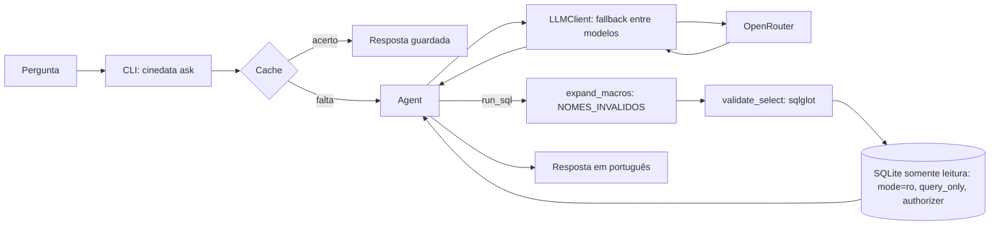

# CineData Agent

Agente Text-to-SQL em Python que responde, em português, perguntas em linguagem natural sobre o catálogo de filmes da CineData. Ele consulta o banco `data/cinerocket.db` (SQLite, camada Gold) **somente para leitura**, por tool calling direto, sem LangChain. Os modelos vêm do OpenRouter e são os gratuitos (sufixo `:free`), em ordem de fallback.

## Arquitetura



## Pré-requisitos

- Python 3.11 ou superior (o projeto é testado em 3.12, versão usada no CI).
- Git.
- Conta gratuita no [OpenRouter](https://openrouter.ai).

## Instalação

**Windows (PowerShell):**

```powershell
git clone https://github.com/AdrianMichael5/cinedata-agent.git
cd cinedata-agent
py -3.12 -m venv .venv
.venv\Scripts\Activate.ps1
pip install -e ".[dev]"
```

**Linux/macOS:**

```bash
git clone https://github.com/AdrianMichael5/cinedata-agent.git
cd cinedata-agent
python3.12 -m venv .venv
source .venv/bin/activate
pip install -e ".[dev]"
```

## Banco de dados

O arquivo `cinerocket.db` (581 MB) não é versionado: ele vem no material da atividade. Coloque-o em `data/cinerocket.db`. Se chegar com outro nome, como `cinerocket (1).db`, renomeie.

Verificação:

```bash
cinedata sql "SELECT COUNT(*) FROM dim_movies"
```

O resultado deve mostrar `95645`.

## Chave do OpenRouter

1. Crie uma chave em [openrouter.ai/keys](https://openrouter.ai/keys).
2. Copie `.env.example` para `.env` e preencha `OPENROUTER_API_KEY`.

Nunca commite o `.env`. Ele já está no `.gitignore`.

| Variável | Padrão | O que faz |
|---|---|---|
| `OPENROUTER_API_KEY` | vazio | Chave da API do OpenRouter. Obrigatória para `ask`, `quota` e `models`. |
| `OPENROUTER_BASE_URL` | `https://openrouter.ai/api/v1` | Endereço base da API compatível com o SDK `openai`. |
| `LLM_MODELS` | cinco modelos, qwen primeiro | Ordem de fallback, separada por vírgulas. Modelos repetidos são removidos. |
| `DB_BACKEND` | `sqlite` | Backend do banco. `databricks` está reservado, mas ainda não foi implementado. |
| `DB_PATH` | `data/cinerocket.db` | Caminho do arquivo SQLite. |
| `QUERY_TIMEOUT_SECONDS` | `120` | Tempo máximo de uma consulta SQL. Pares ator-diretor levam cerca de 55 s no banco real. |
| `MAX_ROWS` | `200` | Linhas máximas devolvidas por consulta ao modelo. |
| `MAX_LLM_CALLS_PER_QUESTION` | `3` | Chamadas lógicas ao modelo por pergunta. |
| `MAX_REQUESTS_PER_QUESTION` | `6` | Requisições HTTP por pergunta, somando as tentativas de fallback. |
| `MAX_OUTPUT_TOKENS` | `2000` | Tokens de saída por chamada (`max_tokens`). Corta respostas degeneradas. |
| `LLM_REASONING_EFFORT` | `low` | Esforço de raciocínio enviado ao modelo. Vazio = não envia. |
| `CACHE_DIR` | `.cache` | Pasta do cache de respostas. |
| `REQUEST_LOG_PATH` | `logs/requests.jsonl` | Log com uma linha JSON por requisição ao OpenRouter (sem chave e sem prompt). |
| `REFERENCE_DATE` | vazio = hoje | Data de referência para janelas como "últimos N anos", no formato `AAAA-MM-DD`. |
| `LOG_LEVEL` | `INFO` | Nível de log: `DEBUG`, `INFO`, `WARNING`, `ERROR` ou `CRITICAL`. |
| `DATABRICKS_SERVER_HOSTNAME` | vazio | Reservado para o backend Databricks. |
| `DATABRICKS_HTTP_PATH` | vazio | Reservado para o backend Databricks. |
| `DATABRICKS_TOKEN` | vazio | Reservado para o backend Databricks. |

## Como usar

```bash
cinedata ask "Quantos filmes de terror foram lançados em 2023?"
cinedata ask "Quais produtoras lucraram mais?" --show-sql
cinedata ask "Quantos filmes de terror foram lançados em 2023?" --no-cache
cinedata sql "SELECT COUNT(*) FROM dim_movies"
cinedata quota
cinedata models
cinedata requests --today
cinedata cache clear
cinedata --version
```

- `ask`: responde à pergunta. `--show-sql` mostra as SQLs executadas. `--no-cache` ignora a resposta guardada e consulta o modelo de novo; uma resposta completa nova ainda atualiza o cache.
- `sql`: executa uma consulta `SELECT` ou `WITH` somente leitura, pelo mesmo caminho do agente.
- `quota`: mostra o uso da cota diária do OpenRouter. A cota renova às 21h (Brasília).
- `models`: lista os modelos gratuitos com suporte a tools.
- `requests --today`: soma as requisições do log local, sem gastar requisições.
- `cache clear`: apaga as respostas guardadas.
- `--version` (ou `-V`): mostra a versão instalada.

## Exemplos reais

<!-- PREENCHER APÓS EVAL -->

## Decisões de projeto

| Tema | Decisão | Onde está |
|---|---|---|
| Framework | Tool calling direto com o SDK `openai` apontado para o OpenRouter. Sem LangChain. | `llm/client.py`, `agent.py` |
| Data de referência | "Últimos N anos" usa `REFERENCE_DATE` (padrão: hoje). A data entra na chave do cache. | `config.py`, `cache.py` |
| Lucro | Só entra quando `receita_usd > 0 AND orcamento_usd > 0`. | `prompts/sqlite.md`, regra 4 |
| Filtros mínimos | Cada filtro vale só para a sua métrica e é declarado na resposta: orçamento >= US$ 100 mil para margem por filme; >= 100 votos em TMDB e IMDb para divergência entre bases; >= 3 avaliações por `sk_movie_id` para divergência com a nota dos usuários. Nunca se combinam numa mesma pergunta. | `prompts/sqlite.md`, regra 6 |
| Moeda | Valores absolutos em R$ (colunas `_brl`). Margens e ROI usam as colunas `_usd`, porque a cotação em R$ varia por filme e mudaria o peso de cada filme na soma. | `prompts/sqlite.md`, regras 2 e 5 |
| Nota | "Nota" sem qualificação é IMDb (`nota_imdb`). TMDB só quando o usuário pede ou quando compara as duas bases. "Nota dos usuários" é `movie_reviews.rating`. | `prompts/sqlite.md`, regra 3 |
| Rankings | Sempre até 10 linhas, mesmo quando a pergunta está no singular. Nunca `LIMIT 1`. | `prompts/sqlite.md`, "Como trabalhar" |
| Contagem por obra | Pessoa, dupla, produtora e "mais avaliados" contam obras (título + data), não `sk_movie_id`. Limiares de quantidade de avaliações são por `sk_movie_id`. | `prompts/sqlite.md`, regra 7 |
| Nomes inválidos | Idiomas, países e gêneros cadastrados como pessoas ou produtoras são excluídos pela macro `{{NOMES_INVALIDOS}}`, expandida antes da validação. | `db/schema.py`, `db/sqlite.py` |
| Ordem dos modelos | `qwen/qwen3.8-27b:free` primeiro, porque respondeu em 6 a 8 s por chamada (~500 tokens) num teste A/B real. Os modelos de raciocínio mais longo vêm depois, e `openrouter/free` fica por último, porque cada chamada pode cair num modelo diferente. | `config.py`, comentário em `DEFAULT_LLM_MODELS` |

## Guardrails

- **Conexão somente leitura:** o SQLite abre com `mode=ro` e `PRAGMA query_only = ON`.
- **Validador por AST:** `validate_select` usa sqlglot e aceita uma única instrução `SELECT`, com ou sem `WITH`, `UNION`, `INTERSECT` ou `EXCEPT`. Rejeita escrita, `ATTACH`, `PRAGMA`, `SELECT ... INTO` e funções como `load_extension`, `readfile` e `writefile`.
- **Lista de tabelas permitidas:** só as 10 tabelas da camada Gold. CTEs valem apenas no escopo da própria consulta. `sqlite_master` e as demais tabelas ficam de fora.
- **Authorizer do SQLite:** segunda camada. Nega toda ação fora de SELECT, READ, FUNCTION e RECURSIVE e toda leitura de tabela fora da lista permitida.
- **`json_each` só com literal:** as funções `json_each` e `json_tree` só aceitam texto literal, para expandir listas fixas.
- **Limites de execução:** tempo máximo por consulta (`QUERY_TIMEOUT_SECONDS`), linhas máximas por resultado (`MAX_ROWS`) e tamanho máximo de valor de 10 MB.
- **Resposta degenerada:** o agente descarta respostas com mais de 6.000 caracteres ou com trecho repetido 20 vezes ou mais seguidas. Tenta uma vez mais, com o próximo modelo, se o orçamento permitir; caso contrário, responde em Python com um aviso.
- **Resposta truncada:** `finish_reason = "length"` conta como falha do modelo naquela chamada. O agente passa ao próximo modelo e registra `error_type: "truncated"` no log.
- **Números vindos de `run_sql`:** é uma instrução do prompt ("nunca invente números"), e não uma verificação automática do código.

## Resiliência e economia de cota

| Resposta do OpenRouter | Ação |
|---|---|
| 401 (chave inválida) | Para. Mensagem de chave inválida. |
| 402 (saldo insuficiente) | Para. Mensagem de saldo. |
| 429 de cota diária | Para. `QuotaExhaustedError`. |
| 429 de capacidade do provedor | Passa ao próximo modelo. |
| 400 ou 404 de modelo indisponível ou sem tools | Passa ao próximo modelo. |
| 408 ou 5xx | Passa ao próximo modelo. |
| Outro 4xx | Para, com erro do OpenRouter. |
| Timeout ou falha de conexão | Passa ao próximo modelo. |
| Resposta inválida, vazia ou truncada | Passa ao próximo modelo. |

- `max_retries = 0` no SDK. O SDK não repete 429 nem 5xx sozinho, porque cada repetição consome cota.
- Teto de requisições por pergunta (`MAX_REQUESTS_PER_QUESTION`) e de chamadas lógicas (`MAX_LLM_CALLS_PER_QUESTION`). Quando o teto é atingido e já há um resultado de SQL, o agente responde com esse resultado e um aviso.
- Cache de respostas por pergunta normalizada, data de referência, hash do prompt e backend. Só respostas completas são gravadas.
- Log de requisições em `logs/requests.jsonl`, consultado por `cinedata requests --today`.
- `cinedata quota` mostra o uso da cota.

<!-- CONFIRMAR: o 429 de capacidade do provedor parece não consumir cota, e o contador diário tem atraso. Não há medição no repositório; o log local não guarda leituras do contador. Preencher com a medição feita ou remover. -->

## Testes e avaliação

```bash
pytest                              # unitários, sem rede e sem .env
pytest -m integration               # usa data/cinerocket.db; pulados se o arquivo não existir
python eval/run_eval.py             # avalia o agente em eval/gabarito.json
python eval/run_eval.py --dry-run   # lista as perguntas e a estimativa de cota, sem chamar o modelo
```

A avaliação compara as respostas de forma determinística, sem usar um modelo como juiz. Cada referência do gabarito recebe uma classe:

- **esperada:** a resposta principal da pergunta, ou a variante com filtro mínimo quando o gabarito define uma.
- **alternativa válida:** outra leitura legítima da pergunta. Acertá-la aprova a resposta.
- **armadilha:** o erro documentado no gabarito. Acertá-la reprova a resposta, e o relatório registra qual armadilha foi atingida.

A aprovação exige que o primeiro colocado coincida e que pelo menos 80% das chaves esperadas do top 5 apareçam no top 5 da resposta. Para as perguntas em que a armadilha repete as mesmas entidades na mesma ordem da esperada, a checagem também compara o valor do primeiro colocado, com tolerância de 1%.

O prompt não usa as perguntas do eval como exemplos. Um teste garante que nenhum exemplo do prompt coincide com as perguntas do gabarito, e outro garante que o prompt não cita o gabarito nem o eval.

Placar: <!-- PREENCHER APÓS EVAL -->

## Estrutura de pastas

```
cinedata-agent/
├── src/cinedata_agent/
│   ├── agent.py          # loop de tool calling, orçamento, respostas degeneradas
│   ├── cache.py          # cache de respostas em disco
│   ├── cli.py            # comandos do typer
│   ├── config.py         # configuração via .env e variáveis de ambiente
│   ├── tools.py          # ferramenta run_sql
│   ├── db/               # interface, SQLite, validador, macros e backend Databricks (reservado)
│   ├── llm/              # cliente OpenRouter com fallback, erros, cota e log de requisições
│   ├── prompts/          # sqlite.md, montagem do prompt e vocabulário de gêneros
│   └── evaluation/       # gabarito, comparação, classificação, execução e relatório
├── eval/                 # gabarito.json, GABARITO.md, run_eval.py, resultados
├── tests/                # unitários e integração
├── .github/workflows/    # CI: ruff, mypy e pytest com cobertura mínima de 80%
├── .env.example
└── pyproject.toml
```

## Relação com a atividade de Engenharia de Dados

A parte de Engenharia de Dados do mesmo projeto está em [cinedata-analytics-databricks](https://github.com/AdrianMichael5/cinedata-analytics-databricks), com um pipeline Bronze → Silver → Gold no Databricks.

A camada Gold oficial é o `cinerocket.db`, o arquivo SQLite que este agente consulta. Ele usa o mesmo schema do projeto, com a tabela `alembic_version` a mais. A Gold do autor, no Databricks, difere dela em pontos concretos:

- 97.611 filmes, contra 95.645 no `cinerocket.db`.
- Chaves `BIGINT`, e não texto.
- A tabela fato só tem filmes lançados.
- Lucro é `NULL` quando falta receita ou orçamento.
- Popularidade e nomes inválidos já vêm limpos.
- Conversão para R$ com a cotação mais recente, igual para todos os filmes. No `cinerocket.db`, cada filme tem a cotação da sua data.
- Não tem `movie_reviews`, só `dim_reviews`. Tem a `gold_genai_movies_context`, para uma futura busca semântica.

O agente consulta o `cinerocket.db` porque ele é o arquivo que o avaliador consegue acessar; o workspace do Databricks não é acessível a ele. A opção `DB_BACKEND=databricks` está prevista, mas o adaptador ainda não foi implementado.

## Limitações conhecidas

- **Cópias do mesmo filme com datas diferentes.** Há filmes com vários `sk_movie_id`, e algumas cópias têm datas de lançamento distintas. A chave de obra (título + data) não junta essas cópias, e o agente cita isso como limitação quando afeta a resposta.
- **Outliers financeiros.** Há orçamentos de US$ 1 e receitas minúsculas. Os filtros mínimos do prompt existem por causa disso, mas não cobrem todos os casos.
- **Variação entre modelos gratuitos.** Os modelos mudam de qualidade e de latência ao longo do tempo. O log local registra 14 respostas 429 de capacidade do provedor. As respostas podem variar entre execuções, e o cache só guarda respostas completas.
- **Consultas com duas junções de pessoas.** A SQL do agente para a dupla ator–diretor levou cerca de 55 s no banco real. Uma variante que seguia a orientação de filtrar cedo levou cerca de 3 min. Por isso o limite padrão é de 120 s.
- **Dados de 2024 e 2025.** Há poucos filmes lançados nesses anos, e quase nenhum em 2025.
