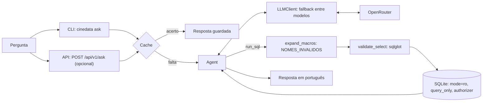

# CineData Agent

Agente Text-to-SQL em Python que responde, em português, perguntas em linguagem natural sobre o catálogo de filmes da CineData.
Ele consulta o banco `data/cinerocket.db` (SQLite, camada Gold) **somente para leitura**, por tool calling direto, sem LangChain.
Os modelos são os gratuitos do OpenRouter: quatro com sufixo `:free` e o roteador `openrouter/free` por último, em ordem de fallback.

**Índice:** [Início rápido](#início-rápido) · [Como usar](#como-usar) · [Exemplos reais](#exemplos-reais) · [Aderência ao enunciado](#aderência-ao-enunciado) · [Arquitetura](#arquitetura) · [Decisões de projeto](#decisões-de-projeto) · [Guardrails e resiliência](#guardrails-e-resiliência) · [Testes e avaliação](#testes-e-avaliação) · [Limitações conhecidas](#limitações-conhecidas) · [Apêndices](#apêndice-a-variáveis-do-env)

## Início rápido

**Pré-requisitos:** Python 3.11 ou superior (exigido pelo `pyproject.toml`; testado só em 3.12, a versão do CI), Git e uma conta gratuita no [OpenRouter](https://openrouter.ai).

**1. Instale.**

```powershell
# Windows (PowerShell)
git clone https://github.com/AdrianMichael5/cinedata-agent.git
cd cinedata-agent
py -3.12 -m venv .venv
.venv\Scripts\Activate.ps1   # se for bloqueado: Set-ExecutionPolicy -Scope Process -ExecutionPolicy Bypass
pip install -e ".[dev]"
```

```bash
# Linux/macOS
git clone https://github.com/AdrianMichael5/cinedata-agent.git
cd cinedata-agent
python3.12 -m venv .venv
source .venv/bin/activate
pip install -e ".[dev]"
```

**2. Coloque o banco.** O `cinerocket.db` (581 MB) vem no material da atividade e não é versionado. Crie a pasta `data` (`mkdir data`) e copie o arquivo para `data/cinerocket.db`. Se ele chegar como `cinerocket (1).db`, renomeie. Confira, sem precisar de chave:

```bash
cinedata sql "SELECT COUNT(*) FROM dim_movies"   # deve mostrar 95645
```

**3. Configure a chave.** Crie uma chave em [openrouter.ai/keys](https://openrouter.ai/keys), copie o modelo do `.env` e preencha `OPENROUTER_API_KEY`. O `.env` está no `.gitignore`; nunca o commite.

```bash
cp .env.example .env              # PowerShell: Copy-Item .env.example .env
cinedata quota                    # confere a chave e mostra a cota, sem gastar requisições
```

**4. Faça a primeira pergunta.**

```bash
cinedata ask "Quantos filmes de terror foram lançados em 2023?"
```

A resposta termina com um rodapé: modelo usado, chamadas ao LLM e requisições ao OpenRouter. Pelo enunciado, a conta gratuita tem **50 requisições por dia**. Uma pergunta costuma usar 2 e nunca passa de 6 ([teto por pergunta](#guardrails-e-resiliência)). Uma pergunta repetida vem do cache e não gasta nada. As demais variáveis do `.env` estão no [Apêndice A](#apêndice-a-variáveis-do-env).

## Como usar

| Comando | O que faz |
|---|---|
| `cinedata ask "pergunta"` | Responde em português. Usa o cache se a pergunta já foi respondida. |
| `cinedata ask "pergunta" --show-sql` | Mostra também as SQLs executadas. |
| `cinedata ask "pergunta" --no-cache` | Consulta o modelo de novo e atualiza o cache. |
| `cinedata sql "SELECT ..."` | Executa uma consulta somente leitura pelo mesmo caminho do agente. Não usa o LLM. |
| `cinedata quota` | Mostra o uso da cota diária. Renova às 00h UTC (21h em Brasília). Não gasta requisições. |
| `cinedata models` | Lista os modelos gratuitos com suporte a tools e diagnostica os do `LLM_MODELS`. Não precisa de chave. |
| `cinedata requests [--today]` | Soma as requisições do log local, no total ou só do dia da cota. |
| `cinedata cache clear` | Apaga as respostas guardadas. |
| `cinedata --version` | Mostra a versão instalada (`-V`). |
| API HTTP | `POST /api/v1/ask` com FastAPI, opcional. Veja o [Apêndice D](#apêndice-d-api-http-fastapi). |

## Exemplos reais

Respostas do eval final de 04/10/2026 (`eval/results/latest.md`), resumidas: frase de abertura e as 3 primeiras linhas da tabela.

**Q04: "Os 5 filmes mais populares"**, armadilha dos anos gravados na coluna de popularidade evitada. Modelo `qwen/qwen3.8-27b:free`, 3 requisições.

> Os 5 filmes mais populares do catálogo são liderados por **Blue Beetle** (2023), com índice de popularidade de 2.994,4.
>
> | # | Filme | Lançamento | Popularidade |
> |---|---|---|---|
> | 1 | Blue Beetle | 2023-08-16 | 2.994,4 |
> | 2 | Gran Turismo | 2023-08-09 | 2.680,6 |
> | 3 | The Nun II | 2023-09-06 | 1.692,8 |

**Q01: "Top 10 filmes com maior receita em R$"**, ranking em R$. Modelo `nvidia/nemotron-3-super-120b-a12b:free`, 3 requisições.

> Os 10 filmes com maior receita em R$ são:
>
> | titulo | ano_lancamento | receita_brl |
> |---|---|---|
> | Avatar: The Way Of Water | 2022 | 12.390.136.500,54 |
> | Avengers: Endgame | 2019 | 11.094.720.000,00 |
> | Spider-man: No Way Home | 2021 | 10.977.782.882,74 |

**Q09: "Dupla ator–diretor que mais trabalhou junta"**, contagem por obra. Modelo `qwen/qwen3.8-27b:free`, 3 requisições.

> A dupla ator–diretor que mais trabalhou junta é **Joe Anoa'i** com **Kevin Dunn**, em 37 obras.
>
> | Ator | Diretor | Obras |
> |---|---|---|
> | Joe Anoa'i | Kevin Dunn | 37 |
> | Colby Lopez | Kevin Dunn | 32 |
> | Jeff Kirkendall | Mark Polonia | 25 |

**Q12: "Gênero com maior margem de lucro média"**, margem agregada (`SUM(lucro) / SUM(receita)`). Modelo `qwen/qwen3.8-27b:free`, 3 requisições.

> O gênero com maior margem de lucro agregada é **Terror (Horror)**, com 75,92% de margem sobre 168 filmes.
>
> | Gênero | Margem (%) | Filmes |
> |---|---|---|
> | Terror | 75,92 | 168 |
> | Aventura | 69,59 | 246 |
> | Animação | 69,45 | 97 |

A SQL executada de cada pergunta está em `eval/results/latest.md`. Para vê-la numa pergunta sua:

```bash
cinedata ask "Gênero com maior margem de lucro média" --show-sql
```

## Aderência ao enunciado

| Requisito | Como foi atendido | Onde |
|---|---|---|
| Python | Python 3.11+, pacote instalável com o comando `cinedata` | `pyproject.toml` |
| Text-to-SQL somente leitura sobre a Gold | Ferramenta `run_sql` e três camadas de proteção | [Guardrails](#guardrails-e-resiliência) |
| Framework de agente livre | Tool calling direto com o SDK `openai`, sem framework | `agent.py`, `llm/client.py` |
| Modelos `:free` do OpenRouter com tool calling | Lista ordenada com fallback; `cinedata models` verifica o suporte a tools | `config.py` |
| Projeto Python, notebook ou módulo FastAPI | CLI e, opcionalmente, API FastAPI | `cli.py`, `api.py` |
| README passo a passo | [Início rápido](#início-rápido) | este arquivo |
| Limite de 50 requisições por dia | Cache, teto por pergunta, `max_retries=0`, log local e `cinedata quota` | [Guardrails e resiliência](#guardrails-e-resiliência) |
| Receita = Faturamento = Bilheteria | Regra 1 do prompt | `prompts/sqlite.md` |
| Perguntas de exemplo do enunciado | As 14 estão no gabarito, com avaliação automática | `eval/gabarito.json` |
| Extras: guardrails, fallback, cache, avaliação | Implementados | seções abaixo |
| Extra: módulo FastAPI | Implementado, opcional | [Apêndice D](#apêndice-d-api-http-fastapi) |
| Extras: interface visual, gráficos, memória de conversa, busca semântica, Gold no Databricks | **Não implementados.** `DB_BACKEND=databricks` gera erro. | — |

## Arquitetura



- **CLI e API** (`cli.py`, `api.py`): recebem a pergunta e consultam o cache antes de chamar o agente.
- **Cache** (`cache.py`): guarda só respostas completas, com chave por pergunta, data de referência, prompt e backend ([Apêndice C](#apêndice-c-cache-e-logs)).
- **Agent** (`agent.py`): loop de tool calling com teto de chamadas e de requisições e descarte de respostas degeneradas.
- **LLMClient** (`llm/client.py`): tenta os modelos em ordem, decide pelo tipo de erro se passa ao próximo ou para, e registra cada requisição.
- **Prompt** (`prompts/sqlite.md`): schema, regras de negócio, armadilhas dos dados e 6 exemplos com perguntas diferentes das do eval.
- **Banco** (`db/`): expande a macro de nomes inválidos, valida a SQL e executa em SQLite somente leitura.

## Decisões de projeto

| Tema | Decisão | Onde |
|---|---|---|
| Framework | Tool calling direto, sem LangChain | `agent.py` |
| Data de referência | "Últimos N anos" usa `REFERENCE_DATE` (padrão: hoje) | `config.py` |
| Sinônimos | Receita = faturamento = bilheteria | prompt, regra 1 |
| Moeda | Valores em R$ (`_brl`); margem e ROI em US$ (`_usd`), porque a cotação em R$ varia por filme | prompt, regras 2 e 5 |
| Nota | "Nota" sem qualificação é IMDb; TMDB só se pedido; "nota dos usuários" é `movie_reviews.rating` | prompt, regra 3 |
| Lucro | Só com `receita_usd > 0 AND orcamento_usd > 0` | prompt, regra 4 |
| Filtros mínimos | Cada um só para a sua métrica e declarado na resposta: orçamento >= US$ 100 mil (margem por filme), >= 100 votos em TMDB e IMDb, >= 3 avaliações por `sk_movie_id` | prompt, regra 6 |
| Contagem por obra | Pessoa, dupla, produtora e "mais avaliados" contam título + data, não ids | prompt, regra 7 |
| Nomes inválidos | Idiomas, países e gêneros cadastrados como pessoas são excluídos pela macro `{{NOMES_INVALIDOS}}` | `db/schema.py` |
| Rankings | Sempre até 10 linhas, mesmo com a pergunta no singular | prompt, "Como trabalhar" |
| Ordem dos modelos | `qwen/qwen3.8-27b:free` primeiro (6 a 8 s e cerca de 500 tokens por chamada num teste A/B); `openrouter/free` por último | `config.py` |

## Guardrails e resiliência

- **Conexão:** SQLite aberto com `mode=ro` e `PRAGMA query_only = ON`.
- **Validador por AST** (sqlglot): uma única instrução `SELECT`, com ou sem `WITH`, `UNION`, `INTERSECT` ou `EXCEPT`. Rejeita escrita, `ATTACH`, `PRAGMA`, `SELECT ... INTO`, `load_extension`, `readfile` e `writefile`.
- **Tabelas:** só as 10 da Gold; CTEs valem só no escopo da própria consulta. `json_each` e `json_tree` só aceitam texto literal.
- **Authorizer do SQLite:** segunda camada; nega qualquer ação fora de leitura e qualquer tabela fora da lista.
- **Limites:** tempo por consulta (`QUERY_TIMEOUT_SECONDS`), linhas por resultado (`MAX_ROWS`) e 10 MB por valor.
- **Resposta degenerada:** mais de 6.000 caracteres, trecho repetido 20 vezes ou raciocínio vazado em inglês. O agente tenta de novo com o próximo modelo se o orçamento permitir; senão, responde com o resultado e um aviso.
- **Resposta truncada** (`finish_reason = "length"`): conta como falha daquele modelo e passa ao próximo.
- **Números:** o prompt manda usar só valores vindos de `run_sql`. É uma instrução, não uma verificação do código.
- **Cota:** `max_retries = 0` no SDK; teto de 6 requisições e 3 chamadas ao LLM por pergunta. Ao atingir o teto com um resultado de SQL já obtido, o agente responde com esse resultado e um aviso.
- **Fallback:** 401, 402 e o 429 de cota diária param na hora; os demais erros passam ao próximo modelo ([Apêndice B](#apêndice-b-erros-do-openrouter)).

## Testes e avaliação

```bash
pytest                              # unitários: sem rede, sem .env, LLM falso
pytest -m integration               # usa data/cinerocket.db; pulados se o arquivo não existir
ruff check . && ruff format --check . && mypy src
python eval/run_eval.py --dry-run   # perguntas e estimativa de requisições; lê a cota, não chama o modelo
python eval/run_eval.py             # avalia o agente nas 14 perguntas de eval/gabarito.json
```

- **CI** (`.github/workflows/ci.yml`): ruff, formatação, mypy e testes unitários com cobertura mínima de 80%.
- **Comparação determinística**, sem modelo como juiz. O primeiro colocado precisa coincidir, e pelo menos 80% das chaves do top 5 esperado precisam aparecer no top 5 da resposta.
- **Desempate por valor:** quando a armadilha lista as mesmas entidades na mesma ordem da resposta esperada, o valor do primeiro colocado também é comparado, com tolerância de 1%.
- **Classes de referência:**
  - **esperada:** a resposta principal, ou a variante com filtro mínimo quando o gabarito define uma;
  - **alternativa válida:** outra leitura legítima, que também aprova;
  - **armadilha:** o erro documentado, que reprova e aparece no relatório.
- **Sem vazamento do eval:** testes garantem que nenhum exemplo do prompt coincide com as perguntas do gabarito e que o prompt não cita o gabarito nem o eval.

### Placar do eval final

Execução de 04/10/2026 com o prompt do commit `a6bf020`, gerada por `python eval/run_eval.py` com `REFERENCE_DATE=2026-10-01` e comparação determinística. Relatório completo, com a SQL de cada pergunta, em `eval/results/latest.md`.

| ID | Pergunta | Aprovada | Bateu com | Modelo | Requisições | Tempo |
|---|---|---|---|---|---|---|
| Q01 | Top 10 filmes com maior receita em R$ | sim | esperada: Ranking em R$ | `nvidia/nemotron-3-super-120b-a12b:free` | 3 | 10,3 s |
| Q02 | Lucro médio por gênero, considerando apenas filmes com receita informada | sim | esperada: Receita e orçamento informados | `qwen/qwen3.8-27b:free` | 2 | 28,7 s |
| Q03 | Filmes com maior margem de lucro, entre os que possuem receita e orçamento informados | sim | esperada: Com orçamento >= US$ 100 mil | `qwen/qwen3.8-27b:free` | 2 | 8,3 s |
| Q04 | Os 5 filmes mais populares | sim | esperada: Sem anos vazados | `qwen/qwen3.8-27b:free` | 3 | 24,0 s |
| Q05 | Filmes com maior divergência entre a nota TMDB e a nota IMDb | sim | esperada: Com >= 100 votos em cada base | `qwen/qwen3.8-27b:free` | 2 | 10,5 s |
| Q06 | Nota média IMDb por ano de lançamento | sim | esperada: Por ano | `qwen/qwen3.8-27b:free` | 2 | 7,8 s |
| Q07 | Ator com mais participações em filmes lançados nos últimos 5 anos | sim | esperada: Janela até hoje, contando por obra | `qwen/qwen3.8-27b:free` | 3 | 87,8 s |
| Q08 | Diretores com maior nota média (mínimo de 5 filmes) | **não** | nenhuma | `qwen/qwen3.8-27b:free` | 2 | 39,4 s |
| Q09 | Dupla ator–diretor que mais trabalhou junta | sim | esperada: Por obra | `qwen/qwen3.8-27b:free` | 3 | 175,8 s |
| Q10 | Quantidade de filmes por gênero | sim | esperada: Por gênero | `qwen/qwen3.8-27b:free` | 2 | 23,6 s |
| Q11 | Produtora com maior lucro total | sim | esperada: Receita e orçamento informados | `qwen/qwen3.8-27b:free` | 2 | 13,2 s |
| Q12 | Gênero com maior margem de lucro média | sim | esperada: Margem agregada: SUM(lucro) / SUM(receita) | `qwen/qwen3.8-27b:free` | 3 | 28,4 s |
| Q13 | Filmes mais avaliados pelos usuários | sim | esperada: Por obra | `qwen/qwen3.8-27b:free` | 2 | 47,0 s |
| Q14 | Filmes em que a nota média dos usuários mais diverge da nota IMDb | sim | esperada: Com >= 3 avaliações | `qwen/qwen3.8-27b:free` | 2 | 12,2 s |

- **13 de 14 aprovadas**, todas pela resposta esperada; **7 de 7 armadilhas evitadas**.
- **33 requisições** para as 14 perguntas: de 2 a 3 por pergunta, por causa do fallback entre modelos. Nenhum aviso de resposta degenerada.
- **Reprovada: Q08.** A referência conta linhas por `sk_movie_id`; o agente conta obras distintas (título + data). O primeiro colocado da referência, Scott Wozniak (5 ids, 4 obras), fica abaixo do mínimo de 5 filmes no agente e sai do ranking. Recall@5 de 0,8: 4 dos 5 primeiros coincidem.
- **Contagem por obra e por id:** as contagens por obra diferem levemente da referência por id (por exemplo, Drama com 28.064 contra 28.086 na Q10). Essas perguntas foram aprovadas porque o primeiro colocado e o ranking coincidem.
- **Tempos:** a Q09 leva cerca de 3 minutos (duas junções de pessoas); as demais, de 8 a 90 s.

## Limitações conhecidas

- **Cópias do mesmo filme com datas diferentes.** A chave de obra (título + data) não junta essas cópias. O agente cita isso quando afeta a resposta.
- **Outliers financeiros.** Há orçamentos de US$ 1 e receitas minúsculas. Os filtros mínimos reduzem o problema, mas não cobrem todos os casos.
- **Variação dos modelos gratuitos.** Qualidade, latência e disponibilidade mudam ao longo do dia (há respostas 429 de capacidade do provedor). Respostas podem variar entre execuções.
- **Consultas com duas junções de pessoas.** A SQL do agente para a dupla ator–diretor levou cerca de 55 s no banco real. Na mesma pergunta, filtrar por papel e período em CTEs antes de juntar levou cerca de 35 a 50 s, e as junções diretas levaram cerca de 180 a 210 s, acima do limite padrão de 120 s. O tempo varia entre execuções.
- **Dados de 2024 e 2025.** Há poucos filmes lançados nesses anos, e quase nenhum em 2025.
- **Q08: contagem de obras e de ids.** A referência conta linhas por `sk_movie_id`; o agente conta obras distintas (título + data), conforme a regra do projeto. Um diretor cujos filmes incluem cópias da mesma obra pode ficar abaixo do mínimo de 5 no agente e dentro dele na referência (caso de Scott Wozniak: 5 ids, 4 obras).

---

## Apêndice A: variáveis do .env

| Variável | Padrão | O que faz |
|---|---|---|
| `OPENROUTER_API_KEY` | vazio | Chave do OpenRouter. Obrigatória para `ask`, `quota` e o eval. |
| `OPENROUTER_BASE_URL` | `https://openrouter.ai/api/v1` | Endereço da API compatível com o SDK `openai`. |
| `LLM_MODELS` | 5 modelos, qwen primeiro | Ordem de fallback, separada por vírgulas. Repetidos são removidos. |
| `DB_BACKEND` | `sqlite` | `databricks` não está implementado e gera erro. |
| `DB_PATH` | `data/cinerocket.db` | Caminho do arquivo SQLite. |
| `QUERY_TIMEOUT_SECONDS` | `120` | Tempo máximo de uma consulta ([por quê](#limitações-conhecidas)). |
| `MAX_ROWS` | `200` | Linhas máximas por resultado. |
| `MAX_LLM_CALLS_PER_QUESTION` | `3` | Chamadas lógicas ao LLM por pergunta. |
| `MAX_REQUESTS_PER_QUESTION` | `6` | Requisições HTTP por pergunta, contando as tentativas de fallback. |
| `MAX_OUTPUT_TOKENS` | `2000` | Tokens de saída por chamada (`max_tokens`). |
| `LLM_REASONING_EFFORT` | `low` | Esforço de raciocínio enviado ao modelo. Vazio = não envia. |
| `CACHE_DIR` | `.cache` | Pasta do cache de respostas. |
| `REQUEST_LOG_PATH` | `logs/requests.jsonl` | Log local de requisições ([Apêndice C](#apêndice-c-cache-e-logs)). |
| `REFERENCE_DATE` | vazio = hoje | Data de referência (`AAAA-MM-DD`) para janelas como "últimos N anos". |
| `LOG_LEVEL` | `INFO` | `DEBUG`, `INFO`, `WARNING`, `ERROR` ou `CRITICAL`. |
| `DATABRICKS_SERVER_HOSTNAME`, `DATABRICKS_HTTP_PATH`, `DATABRICKS_TOKEN` | vazio | Sem uso enquanto o backend Databricks não existir. |

## Apêndice B: erros do OpenRouter

| Resposta | Ação |
|---|---|
| 401 (chave inválida) | Para, com mensagem de chave. |
| 402 (saldo) | Para, com mensagem de saldo. |
| 429 de cota diária | Para (`QuotaExhaustedError`). |
| 429 de capacidade do provedor | Passa ao próximo modelo. |
| 400 ou 404 de modelo indisponível ou sem tools | Passa ao próximo modelo. |
| 408 ou 5xx | Passa ao próximo modelo. |
| Outro 4xx | Para, com o erro do OpenRouter. |
| Timeout ou falha de conexão | Passa ao próximo modelo. |
| Resposta inválida, vazia ou truncada | Passa ao próximo modelo. |

## Apêndice C: cache e logs

- **Chave do cache:** pergunta normalizada, data de referência, hash do prompt do sistema e backend. Mudar o prompt ou a data invalida as respostas antigas.
- **O que entra no cache:** só respostas completas, com SQL executada e texto. Ficam de fora respostas com aviso, as que usaram todas as chamadas ao LLM e as que terminaram com erro de SQL.
- **`logs/requests.jsonl`:** uma linha por requisição ao OpenRouter, com modelo, status, latência, tokens e tipo de erro, sem chave e sem prompt. Na CLI, cada pergunta respondida também grava uma linha `type: "sql"` com o tempo gasto no banco (`sql_ms`). `cinedata requests` ignora essas linhas.
- **Durante a consulta SQL,** a CLI mostra um cronômetro.

## Apêndice D: API HTTP (FastAPI)

```bash
pip install -e ".[api]"
uvicorn cinedata_agent.api:create_app --factory
```

- `POST /api/v1/ask` recebe `{"question": "...", "no_cache": false}` e devolve `answer`, `sql`, `model`, `llm_calls`, `requests`, `from_cache` e `warning`. Usa o mesmo agente e o mesmo cache da CLI.
- `GET /health` devolve `{"status": "ok", "db": "ok"}`, ou HTTP 503 com `"erro"`.
- **Erros:**

| Situação | Resposta |
|---|---|
| Pergunta vazia | 422 |
| Cota diária esgotada | 429 |
| Chave inválida ou falha do OpenRouter | 502 |
| Banco indisponível | 503 |
| Backend não implementado | 501 |

  As mensagens ao cliente são fixas, e o detalhe vai para o log do servidor.
- **Use só em localhost.** Não há autenticação nem limite de requisições: qualquer cliente que alcance o servidor gasta a cota. O uvicorn escuta em `127.0.0.1` por padrão; não use `--host 0.0.0.0`.

```bash
curl -X POST http://127.0.0.1:8000/api/v1/ask -H "Content-Type: application/json" \
  -d '{"question": "Quantos filmes de terror foram lançados em 2023?"}'
```

```powershell
Invoke-RestMethod -Method Post -Uri http://127.0.0.1:8000/api/v1/ask `
  -ContentType "application/json; charset=utf-8" `
  -Body '{"question": "Quantos filmes de terror foram lançados em 2023?"}'
```

## Apêndice E: estrutura de pastas

```
cinedata-agent/
├── src/cinedata_agent/
│   ├── agent.py          # loop de tool calling, tetos, respostas degeneradas
│   ├── api.py            # API HTTP opcional (FastAPI)
│   ├── cache.py          # cache de respostas em disco
│   ├── cli.py            # comandos do typer
│   ├── config.py         # configuração via .env
│   ├── tools.py          # ferramenta run_sql
│   ├── db/               # SQLite, validador, macros
│   ├── llm/              # cliente OpenRouter, erros, cota, log de requisições
│   ├── prompts/          # sqlite.md e montagem do prompt
│   └── evaluation/       # gabarito, comparação, classificação, relatório
├── eval/                 # gabarito.json, GABARITO.md, run_eval.py (resultados locais em eval/results/, não versionados)
├── tests/                # unitários e integração
├── .github/workflows/    # CI
├── .env.example
└── pyproject.toml
```

## Apêndice F: relação com a atividade de Engenharia de Dados

A parte de Engenharia de Dados do mesmo projeto, um pipeline Bronze → Silver → Gold no Databricks, está em [cinedata-analytics-databricks](https://github.com/AdrianMichael5/cinedata-analytics-databricks). Este agente consulta a Gold oficial (`cinerocket.db`), que é o arquivo acessível ao avaliador.

Segundo a documentação da atividade, a Gold do autor difere da oficial em:
- volume: 97.611 filmes, contra 95.645;
- tipo das chaves: `BIGINT`;
- tabela fato só com filmes lançados;
- lucro `NULL` quando falta valor;
- dados já limpos;
- cotação única para R$;
- tabelas: sem `movie_reviews` e com uma tabela de contexto para busca semântica.

Por isso, as regras de negócio e o gabarito deste agente valem para o `cinerocket.db`.
